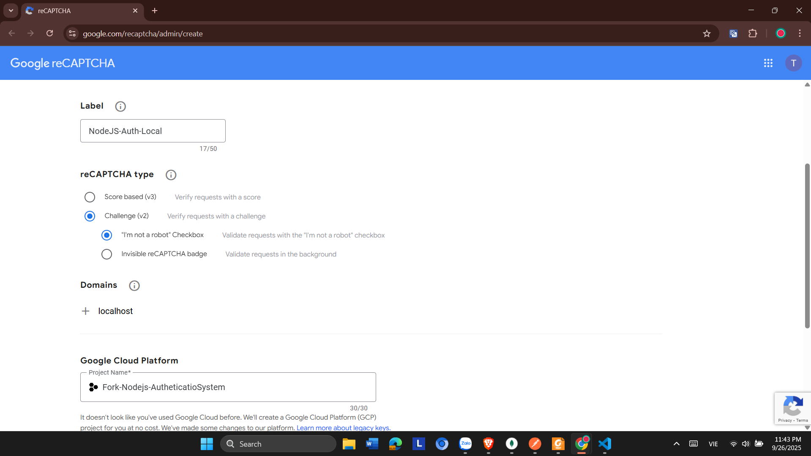
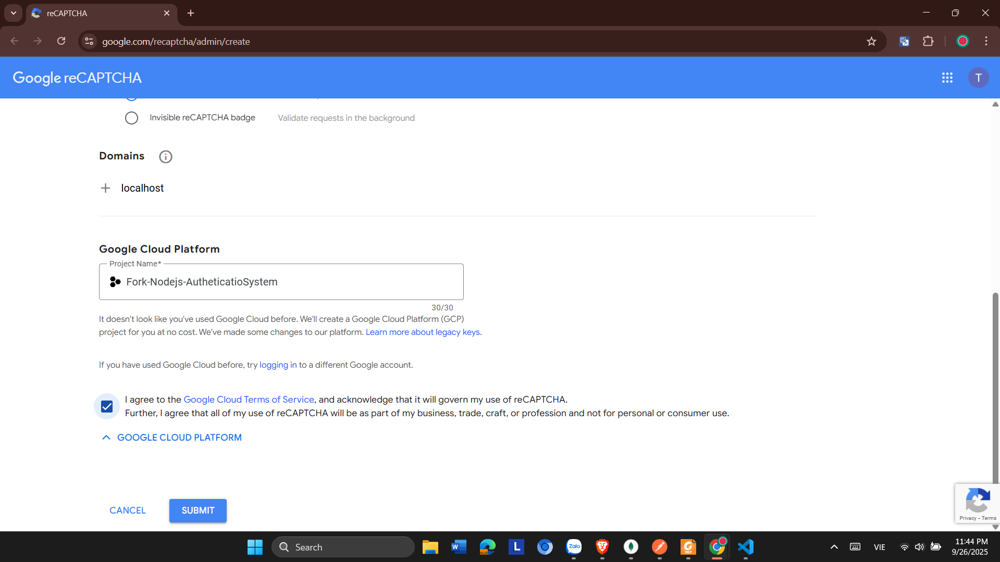
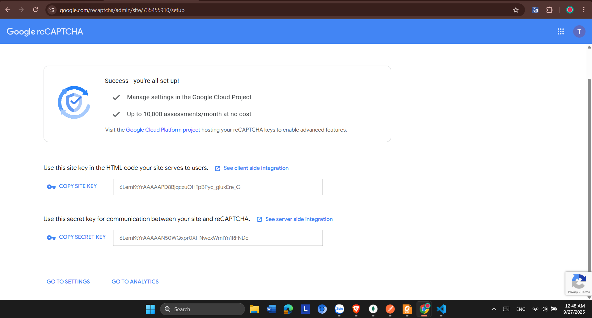
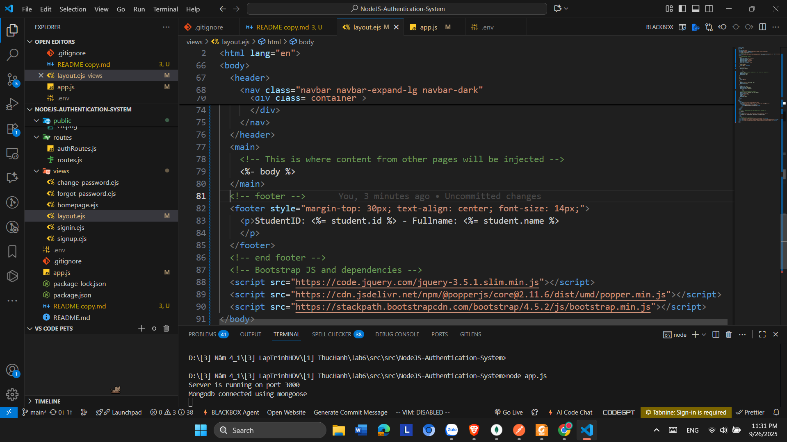
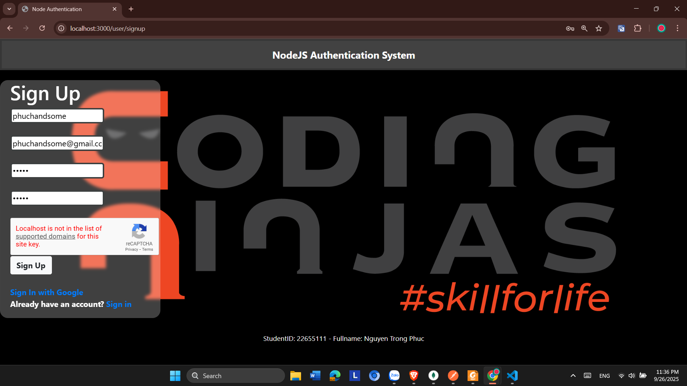
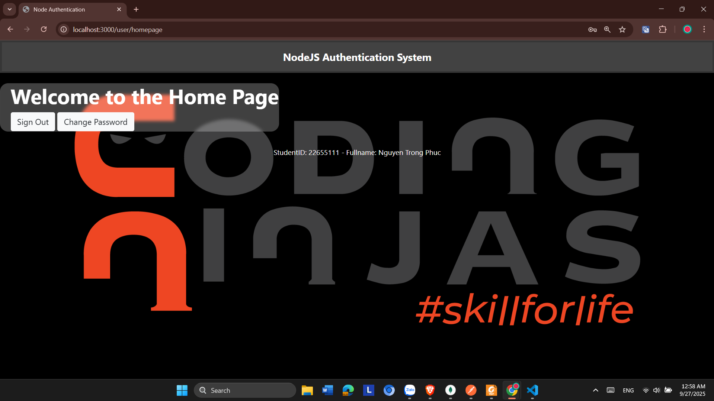
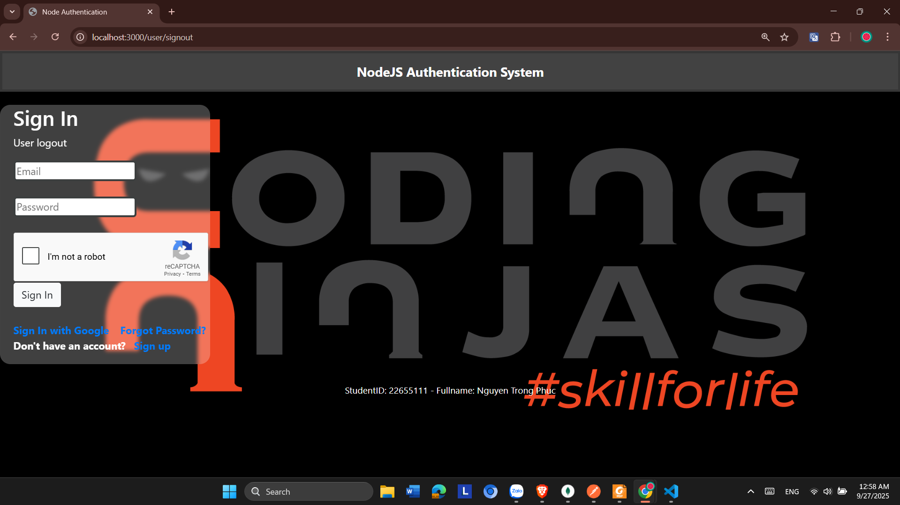
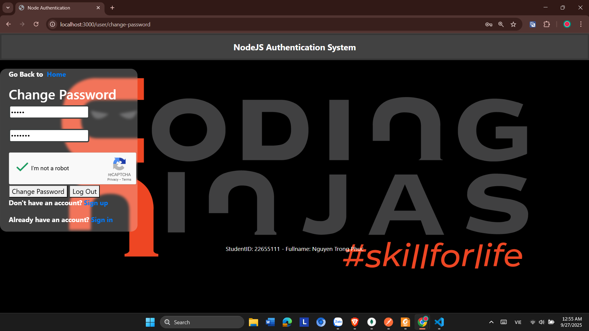
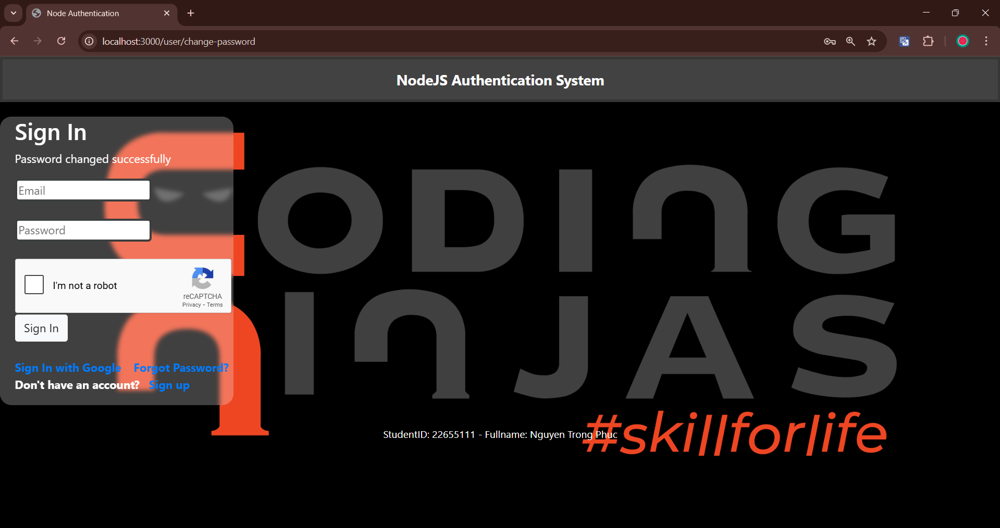
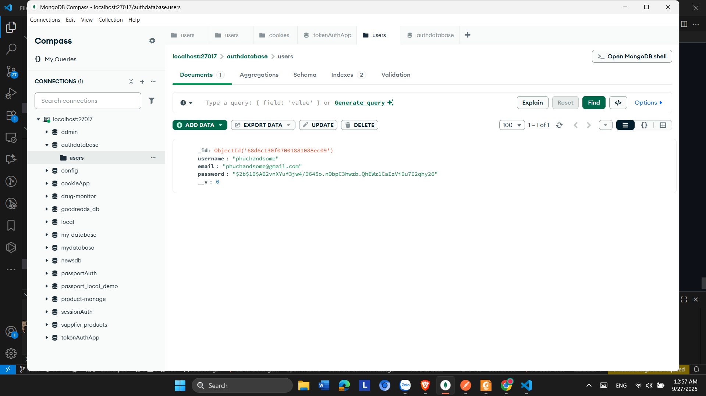

### Bài 6

Fork dự án **NodeJS-Authentication-System** từ link:

👉 [https://github.com/mrhuynhnam/NodeJS-Authentication-System](https://github.com/mrhuynhnam/NodeJS-Authentication-System) về repository của bạn.

**Yêu cầu:**

a. Chỉnh sửa mã nguồn để hoàn thiện ứng dụng cho đúng. (Gợi ý: sử dụng một số hướng dẫn trong repository trên GitHub sau khi fork).

Tạo Captcha

Sau đó chọn Submit

Google cấp

Tạo file .env

b. Hiển thị **mã số sinh viên** và **họ tên đầy đủ** của bạn trên tất cả các trang.

File app.js thêm ngay sau phần cấu hình middleware, để hiện thị mssv + ten

File layout.ejs thêm footer để hiện tên

c. Kiểm thử tất cả các trang theo đúng chức năng của chúng.

1. **Trang Sign up (Đăng ký)**

   * Truy cập: `http://localhost:3000/user/signup`
   * Nhập thông tin user mới:

   
2. **Trang Sign in (Đăng nhập)**

   * Truy cập: `http://localhost:3000/user/signin`
   * Login với tài khoản vừa tạo

   
3. **Trang Homepage (Profile)**

   * Truy cập: `http://localhost:3000/user/homepage`

     
4. **Trang Sign out (Đăng xuất)**

   * Truy cập: `http://localhost:3000/user/signout`

     
5. **Trang Forgot Password (Quên mật khẩu)**

   * Truy cập: `http://localhost:3000/user/forgot-password`
   * Nhập email → nếu có cấu hình Gmail thì check hộp thư (nếu không thì chỉ cần chụp màn hình báo thành công).
8. **Trang Change Password (Đổi mật khẩu)**

   * Truy cập: `http://localhost:3000/user/change-password

     Đổi mật khẩu ban đầu password="12345" -> "1234567"

     
9. **Login bằng Google (OAuth2)**

   * Truy cập: `http://localhost:3000/auth/google`
   * Chọn tài khoản Google → thành công → redirect về `CLIENT_URL` (ví dụ `/auth/login/success`).
   * Nếu từ chối → redirect về `/login/failed`.

d. Chụp màn hình toàn bộ kết quả kiểm thử, đặt tên file theo chức năng kiểm thử.

1. Sign up: User created successfully

Database:

2. Sign In:

Sign In thành công hiện trang HomePage

3. Change Password:

Password changed succefully

Database:

4. Sign out: thành công hiện trang Sign In

Ví dụ:

* `login.png`
* `logout.jpg`

Sau đó, đặt tất cả hình ảnh vào thư mục  **public/results** .

e. Commit toàn bộ project lên repository của bạn
